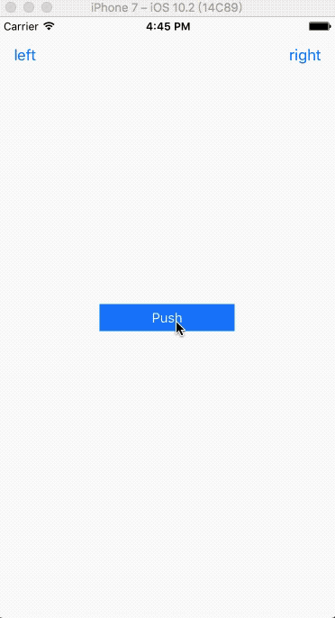

# AntNavigationController

AntNavigationController提供简单API设置导航栏透明度、背景颜色、标题颜色以及填充色，该项目由Objective-C实现，几行代码搞定导航栏相关操作！

# Function

- 一行代码设置导航栏透明度、填充色、标题色、背景色、背景图

# How To Use

- 添加`AntViewController.h` `AntViewController.m  ` `AntNavigationController.h` `AntNavigationController.m`至项目中
- 项目中视图控制器继承`AntViewController`，导航栏继承 `AntNavigationController`

- ```Objective-C
  - (void)viewDidLoad {
      [super viewDidLoad];
      // Do any additional setup after loading the view from its nib.
      self.navigationBarTintColor = [UIColor redColor];
      self.navigationBarAlpha = 1.0;
      self.navigationBarTitleColor = [UIColor redColor];
      self.navigationBarColor = [UIColor yellowColor];
  }
  ```

# TODO

- 支持CocoaPods

- 支持导航栏图片切换（已添加）

- 修复潜在bug，优化用户体验



